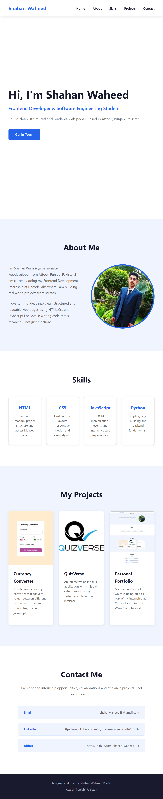

# Personal Portfolio Website

A modern and responsive personal portfolio website developed using **HTML5** and **CSS3** as part of the DecodeLabs Full Stack Development Internship 2026.

---

## Project Overview

This project is a static portfolio website designed to showcase personal information, technical skills, projects, and contact details in a clean and professional layout.

The website follows responsive design principles and is fully optimized for different screen sizes.

---

## Features

- ✅ Responsive Navigation Bar
- ✅ Hero Section
- ✅ About Section
- ✅ Skills Section
- ✅ Projects Showcase
- ✅ Contact Section
- ✅ Mobile-Friendly Design
- ✅ Clean UI Layout
- ✅ W3C Validated — Zero Errors

---

## Technologies Used

- **HTML5**
- **CSS3**
  - Flexbox
  - CSS Grid

---

## Project Structure

```bash
portfolio-decodelabs/
├── images/
│   ├── currency.jpg
│   ├── mypic.jpg
│   ├── portfolio.jpg
│   └── quizverse.jpg
├── index.html
├── README.md
└── style.css
```

---

## Live Demo

🔗 GitHub Repository:  
https://github.com/Shahan-Waheed728/portfolio-decodelabs

---

## Screenshots



---

## Learning Outcomes

Through this project, I learned:

- Responsive web design principles
- Layout building using Flexbox & Grid
- Structuring semantic HTML
- Styling modern UI components with CSS
- GitHub project management and documentation

---

## Future Improvements

- Add JavaScript functionality
- Add dark mode support
- Integrate animations and transitions
- Deploy on Netlify or Vercel
- Add backend contact form functionality

---

## Developed By

**Shahan Waheed**  
Full Stack Developer Intern DecodeLabs Batch 2026

---

## Acknowledgment

Special thanks to DecodeLabs for providing the opportunity to work on real-world development projects during the internship.
